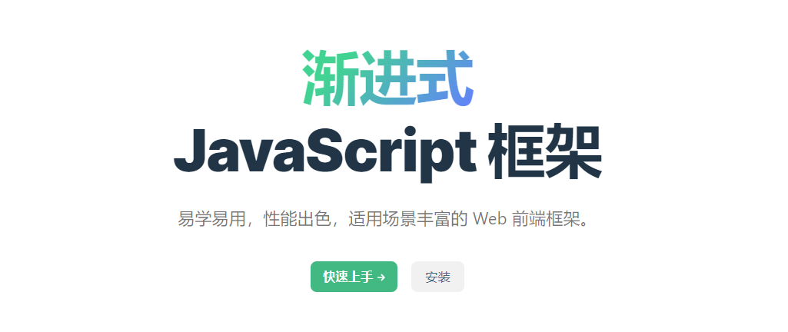
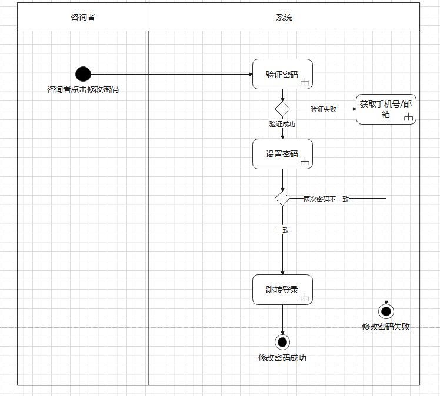
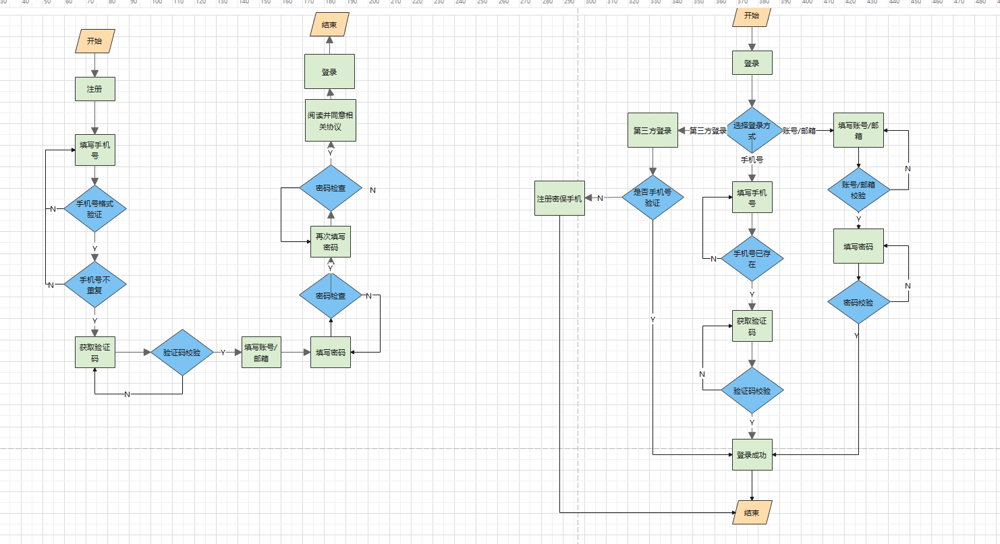
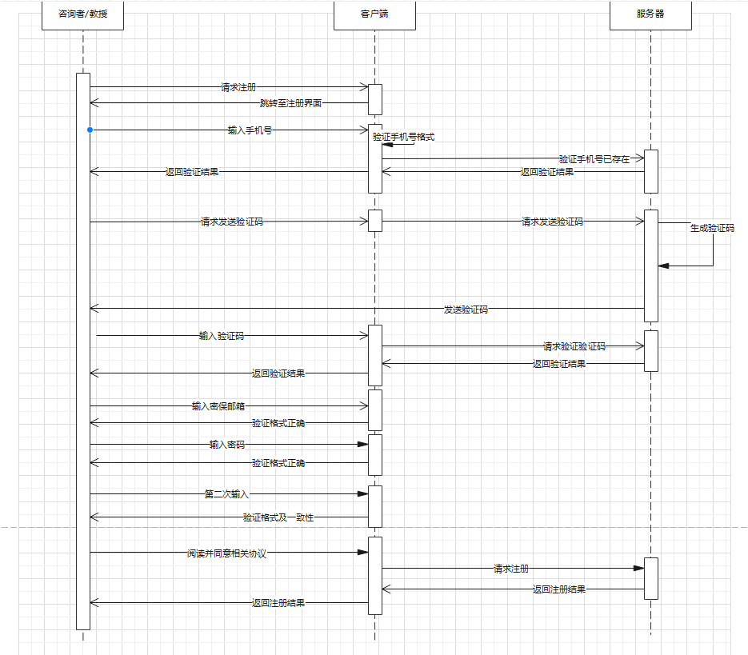
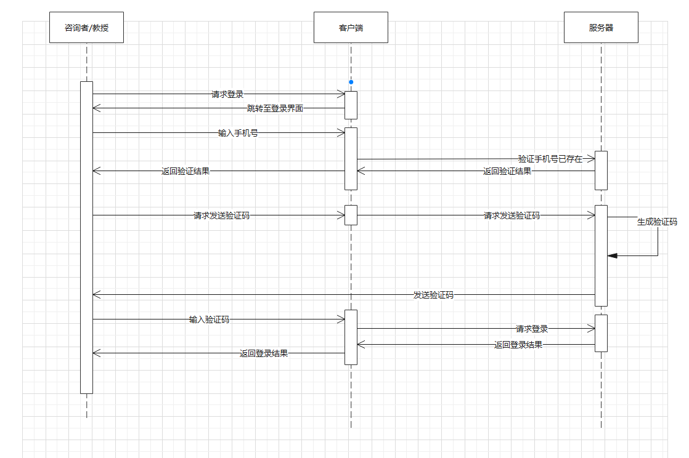
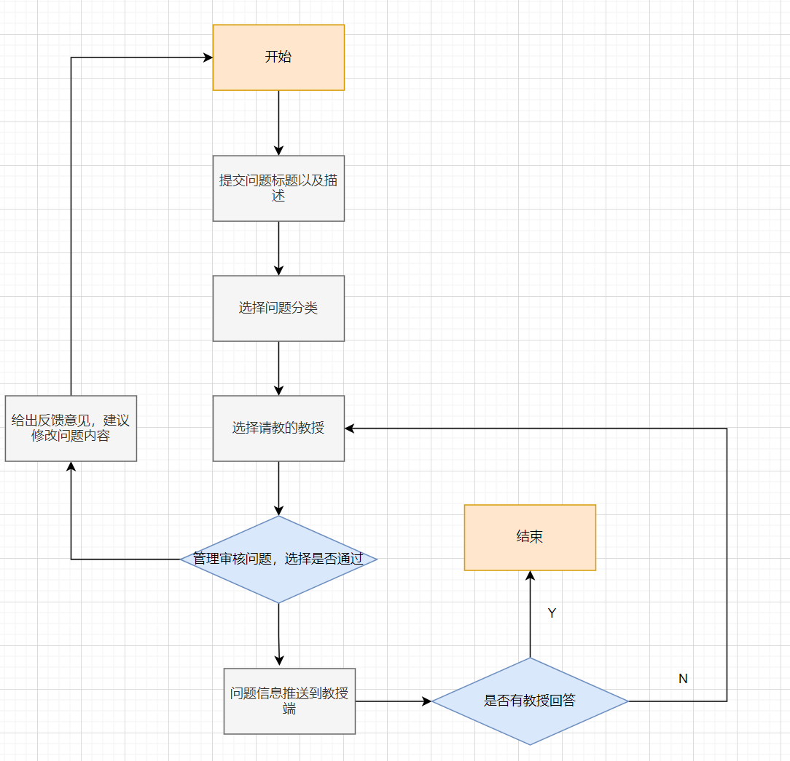
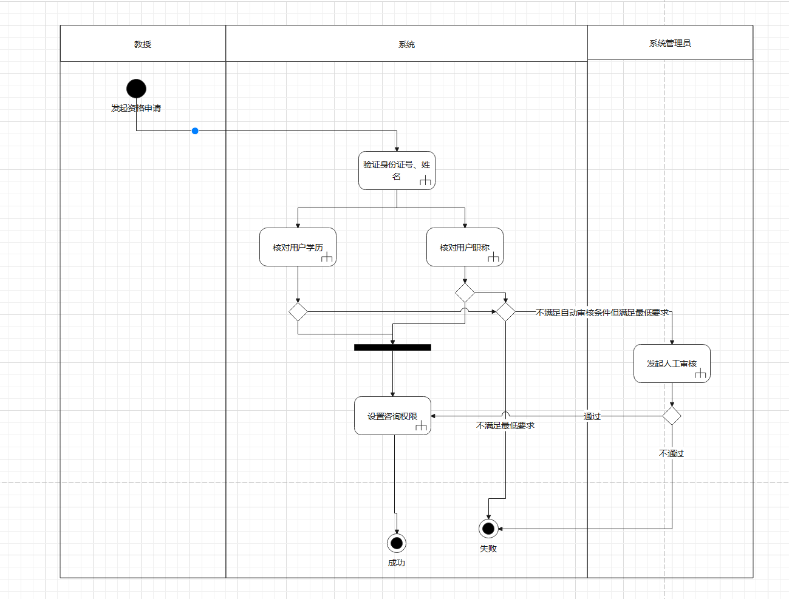
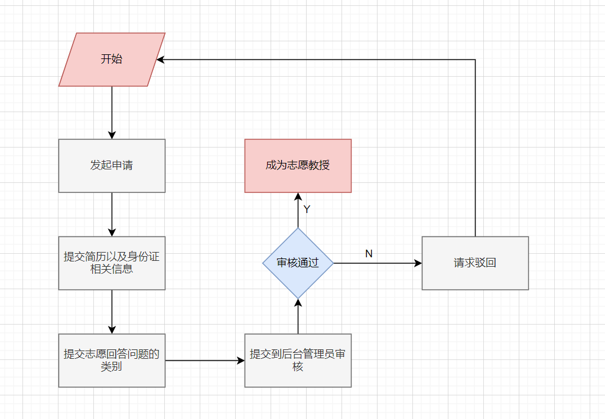
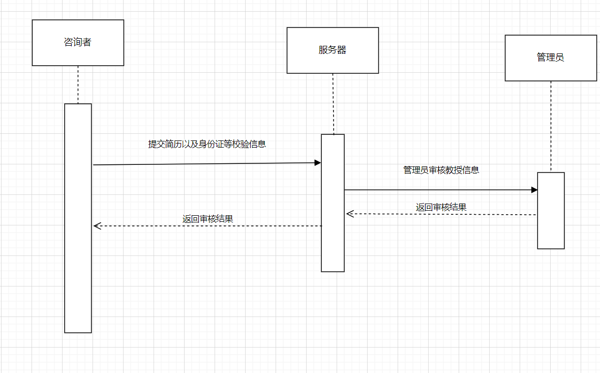

## 第四章系统实现

本章是在第3章的基础上，对系统进行编程实现，介绍系统的软硬件开发环境和平台搭建配置文件，详细介绍各个功能模块的前端页面实现和后台业务逻辑实现，对各个功能的实现细节进行阐述。

### 4.1 软硬件环境

本节主要介绍系统搭建所需的软硬件开发环境要求。

#### 4.1.1 硬件环境

最低配置：CPU：四核 3.4GHZ以上。

硬盘空间：256G以上。

内存：4G以上。

#### 4.1.2软件环境

适合操作系统：Windows 7、Windows 10、Linux等，可跨平台。

数据库：MySQL 5.7。

IE要求：IE8.0以上。

其他要求：JDK1.8，TOMCAT 7.0，Maven3.3.9,Docker 20.10.17,ElasticSearch7.14.0,Redis7.0.4,RabbitMq:3.8

### 4.2 平台架构

教授面对面咨询问答系统采用前后端分离设计，前后端分离设计的好处在于降低了开发人员之间工作的耦合度，后端可以专注于业务逻辑的处理，前端专注于页面交互以及视图美化和展示。

#### 4.2.1 前端架构

教授面对面在线咨询问答系统前端采用HTML+CSS+JavaScript语言进行构建，基础框架选择Vue.js，采用Vue-Cli作为构建项目的脚手架,以及采用了ElementUI作为基础组件库，实现快速开发系统组件，并且统一了UI风格的作用。

**什么是Vue？**



根据官网的描述,Vue是一个渐进式的前端开发框架，也是一个用于创建单页面应用的开发框架，旨在更好地组织与简化Web开发。Vue所关注的核心是[MVC模式](https://zh.m.wikipedia.org/wiki/MVC)中的视图层，同时，它也能方便地获取数据更新，并通过组件内部特定的方法实现视图与模型的交互。

#### 4.2.2 后端架构

教授面对面在线咨询问答系统采用Java语言编写，开发框架选用SpringBoot框架

> SpringBoot是Java Spring框架的集大成者，它通过简化Spring的配置，以约定大于配置的思想删繁就简，大幅提升了Spring的配置过程，凭借优秀的对第三方的组件库的集成，已经成为JavaWeb开发的基础框架之一

数据库方面，本系统采用Mysql数据库，并且通过MybatisPlus框架作为ORM(Object Relational Mapping)对象关系映射框架，可以方便的对mysql数据库进行操作。

另外，本系统还引入了Redis数据库用作热点数据的查询缓存以及会话存储等功能。

> Redis是一款C语言实现的高性能NO-SQL数据库，凭借其优秀的性能成为广泛运用的缓存中间件，也被广泛运用在各种需要高性能存储，快速响应，高可用集群的搭建中。

在系统模块的解耦方面，本系统引入了RabbitMQ作为消息队列，用于本系统不同模块之间的信息通讯以及业务的异步操作，解耦.

> RabbitMQ是一款ErLang语言编写的高性能消息队列，尤其对于消息数据的安全性有很高的保证。

在搜索方面，本系统引入了ElasticSearch作为索引数据的查询引擎，用于实现全文检索，复杂检索等功能。使用倒排索引加快了响应的速度。

下面介绍系统用到的核心配置文件

1. springboot配置文件

   在系统的每个web模块下的resources下都有一个application.yaml文件，这个文件就是springboot的核心配置文件,主要用于配置系统用到的配置类的核心属性，例如数据库的链接参数，es的链接参数，事务相关的配置，对象存储的位置，邮件客户端的配置等等

2. maven配置文件

   本系统采用maven作为构建工具，因此每个模块下的pom.xml是系统构建的核心，这些文件主要定义了项目中模块之间的父子关系，用到的maven核心仓库中的依赖包信息，以及构建时候用到的打包工具和相关的打包配置

### 4.3 教授面对面系统的实现

#### 4.3.1 系统首页实现

暂时未完成，略过

#### 4.3.2 登录注册实现

###### 活动图



###### 流程图



###### 时序图-注册



###### 时序图-登录




注册方面系统提供邮箱注册，手机号注册以及第三方注册三种方案。

- 邮箱注册需要通过系统的邮箱验证码，输入用户名和密码之后进行注册

- 手机号注册需要通过手机短信验证码进行验证，输入用户名和密码进行注册
- 第三方注册可以通过微信和qq账号进行绑定注册。

注册功能的细节:

- 注册会对用户的密码进行加密
- 收到的验证码设置了缓存方案，超过90s会自动失效

登录功能与注册类似，可以通过用户名 密码登录，手机号登录，以及邮箱账号登录三种方式

登录功能的细节:

- 登录控制采用SaToken权限框架进行控制，当用户输入以正确的凭证登录之后后端接口会返回一个Token作为用户的会话凭据，并且将用户的会话信息存入Redis，前端访问后端接口必须携带Token凭据与后端进行通信。
- 后端对于Token的校验采用的SpringBoot的拦截器进行实现，也就是在用户访问需要登录权限的接口时，对用户的Token信息进行校验，如果校验失败则返回对应的错误信息
- 认证之后的鉴权也是通过SaToken实现的，我们为每个用户设置一个权限列表，用户每次访问需要权限控制的敏感资源都会被拦截，系统通过查询用户权限选择是否放行此次请求。

登录实现的核心代码

```java
 BaseUser loginUser = baseUserMapper.selectOne(new QueryWrapper<BaseUser>().eq("email", loginParams.getEmail()));
if (loginUser==null)throw new NotRegisterException();
if (!loginUser.getPassword().equals(SaSecureUtil.md5(loginParams.getPassword())))throw new BadCreditException();
StpUtil.login(loginUser.getId());
SaSession userSession = StpUtil.getSession(true);
loginUser.setPassword(null);
userSession.set("userInfo",loginUser);
return SaResult.ok().setMsg("登录成功").setData(StpUtil.getTokenInfo());
```

整体核心逻辑为，通过用户输入的凭据，进行加密之后与数据库进行匹配，匹配通过则颁发有效的Token，否则抛出异常。

用户鉴权的核心代码

```java
@Component
@Slf4j
public class PermissionConfig  implements StpInterface{
    @Autowired
    AdminService adminService;

    @Override
    public List<String> getPermissionList(Object id, String s) {
        Integer userId = Integer.parseInt((String) id);
        List<Permission>list=adminService.getPermissionList(userId);
        return list.stream().map(Permission::getPermissionCode).collect(Collectors.toList());
    }

    @Autowired
    RoleService roleService;
    @Override
    public List<String> getRoleList(Object id, String s) {
        Integer userId = (Integer) id;
        List<Integer> rids = adminService.roleIdList(userId);
        List<Role> roles = roleService.listByIds(rids);
        return roles.stream().map(Role::getName).collect(Collectors.toList());
    }
}
```

通过重写SaToken框架中获取用户角色的和权限的获取逻辑来得到用户相关的权限校验码，以此为凭据进行权限的校验。然后只需要给敏感资源接口加上对应的注解SaCheckPermission，使用Spring的Aop切面特性就可以进行拦截请求并且鉴权了

```java
@SaCheckPermission("pre_pro:list")
@GetMapping("/professor/all_pre")
public SaResult getAllPreProfessor()
{
    List<BaseUser> preProfessors = baseUserService.list(new QueryWrapper<BaseUser>().eq("user_type", UserType.PRE_PROFESSOR.getCode()));
    return SaResult.ok().setData(preProfessors).setMsg("获取成功");
}
```

#### 4.3.3 用户发表提问以及获取回答实现

###### 流程图



提问与回答的主要过程是： 咨询者在平台上发表问题，发表完成后选择需要咨询的教授（可多选），然后提交到后台由管理员进行审核，问题审核之后推送到对应的教授，如果不通过给出反馈修改意见，然后生成系统消息推送到咨询者指导其根据意见进行修改，如果所有的教授都拒绝回答，则也会生成系统消息返回用户端，引导其重新发起提问流程。

发布问题关键代码: 发布问题会向教授发送通知，所以需要添加事务管理

```java
@Transactional(rollbackFor = Exception.class)
public void pubQuestion(Question dest, List<Integer> proIds)
{
    int curUserId = StpUtil.getLoginIdAsInt();
    questionMapper.insert(dest);
    for (Integer proId : proIds)
    {
        SystemMsg systemMsg = baseMsg();
        systemMsg.setToUserId(proId);
        systemMsg.setMsgType(SysMsgType.USER_QUESTION.getCode());
        systemMsg.setMsgContent("用户"+curUserId
                                +"邀请你回答"+dest.getQuestionTitle()+"问题id:"+dest.getId());
        systemMsgMapper.insert(systemMsg);
        QuestionProfessor qp = new QuestionProfessor();
        qp.setQuestionId(dest.getId());
        qp.setProfessorId(proId);
        questionProfessorMapper.insert(qp);
    }
}
```


问题审核关键代码:

```java
Question question = questionMapper.selectById(auditQuestionParam.getQuestionId());
question.setQuestionStatus(auditQuestionParam.getQuestionStatus());
String sysMsgContent = null;
if (auditQuestionParam.getQuestionStatus().equals(QuestionStatus.FORBIDDEN.getCode()))
{
    sysMsgContent="您的问题<"+question.getQuestionTitle()+">已经被封禁，原因是"+auditQuestionParam.getComment();
}
else  if (auditQuestionParam.getQuestionStatus().equals(QuestionStatus.NORMAL.getCode()))
{
    sysMsgContent="您的问题<"+question.getQuestionTitle()+">发布成功，请等待回答";
}
else  if (auditQuestionParam.getQuestionStatus().equals(QuestionStatus.AUDIT_FAILURE.getCode()))
{
    sysMsgContent="您的问题<"+question.getQuestionTitle()+">审核不通过，请根据意见修改后提交审核";
}
SystemMsg systemMsg = new SystemMsg();
systemMsg.setMsgContent(sysMsgContent);
systemMsg.setFromUserId(0);
systemMsg.setToUserId(question.getUserId());
systemMsg.setMsgType(SysMsgType.USER_QUESTION.getCode());
systemMsgMapper.insert(systemMsg);
return SaResult.ok().setMsg("审核成功");
```


#### 4.3.4 教授资格申请

###### 活动图



###### 流程图



###### 时序图



教授资格的申请的实现主要有如下要点

- 普通咨询者想成为志愿教授，需要提交学信网可查的学历数据以及相关的教育经历简历

- 在申请志愿教授时候，需要指定自己擅长的领域

- 管理员需要根据提交的教授简历信息，以及学信网的数据综合审核资质，决定是否通过

  ，并且设置教授的回答领域

核心代码:

1. 志愿教授申请请求，上传个人信息

```java
@PostMapping("/apply_pro")
@SaCheckLogin
public SaResult requestToBeProfessor(@Validated @RequestBody ReqProfessorParams reqProfessorParams)
{
    SaSession userSession = StpUtil.getSession();
    BaseUser userInfo= (BaseUser) userSession.get("userInfo");
    String cvFileName = userInfo.getCvFileName();
    if (StringUtil.isNullOrEmpty(cvFileName))
        return SaResult.error().setCode(400).setMsg("请先上传简历");
    if (userInfo.getUserType()==UserType.PRE_PROFESSOR.getCode())
        return SaResult.error().setCode(400).setMsg("已经申请过了,请不要重复申请!");
    userInfo.setCardId(reqProfessorParams.getCardId());
    userInfo.setBirthday(reqProfessorParams.getBirthday());
    userInfo.setRealName(reqProfessorParams.getRealName());
    userInfo.setUserType(UserType.PRE_PROFESSOR.getCode());
    userInfo.setCvFileName(cvFileName);
    userSession.set("userInfo",userInfo);
    baseUserService.updateById(userInfo);
    return SaResult.ok().setMsg("申请成功,请等待审核");
}
```

2. 上传简历文件

```java
 @Value("${file.upload.cv.path}")
private String UPLOAD_CV_FOLDER;
public SaResult uploadCVFile(MultipartFile file)
{
    String fname = file.getOriginalFilename();
    //自定义文件名：UUID+扩展名 避免同名覆盖
    String newName = UUID.randomUUID().toString()+ "." + fname.substring(fname.lastIndexOf(".")+1);
    Path path = Paths.get(UPLOAD_CV_FOLDER + newName);
    try
    {
        file.transferTo(path);
        BaseUser me = baseUserMapper.selectById(StpUtil.getLoginIdAsInt());
        me.setCvFileName(newName);
        baseUserMapper.updateById(me);
        SaSession UserSession = StpUtil.getSession(true);
        UserSession.set("userInfo",me);
        return SaResult.ok().setMsg("上传成功");
    }catch (IOException e)
    {
        e.printStackTrace();
        return SaResult.error().setMsg("上传失败 异常为:"+e.getMessage());
    }
}
```

3. 管理员获取学信网学历相关数据

   ```java
   @GetMapping("/edu_datasource/{userId}")
   public SaResult getUserEduDataSource(@PathVariable Integer userId)
   {
       BaseUser baseUser = baseUserService.getById(userId);
       XueXinWangData xueXinWangData = xueXinWangDataService.getOne(
           new QueryWrapper<XueXinWangData>().eq("card_id",baseUser.getCardId())
       );
       List<EduExperience> experiences = eduExperienceService.list(new QueryWrapper<EduExperience>().eq("edu_data_source_id", xueXinWangData.getId()));
       Map<String,Object> res=new HashMap<>();
       res.put("baseInfo",xueXinWangData);
       res.put("experience",experiences);
       return SaResult.ok().setMsg("获取学信网数据成功").setData(res);
   }
   ```

4. 通过教授审核

   ```java
   @PostMapping("/professor/access/{userId}")
   public SaResult accessProfessorProfile(@PathVariable Integer userId)
   {
       BaseUser professor = baseUserService.getById(userId);
       professor.setUserType(UserType.PROFESSOR.getCode());
       baseUserService.updateById(professor);
       return SaResult.ok().setMsg("教授申请审核通过");
   }
   ```

#### 4.3.5 系统消息推送实现

在本系统中，系统消息主要是通过服务器生成，前端轮训的策略进行实现的。系统消息的结构如下

```java
public class SystemMsg
{
    /**
     * 消息id
     */
    @TableId(type = IdType.AUTO)
    private Integer id;
    /**
     * 是否已读
     * @since 0为未读 1为已读
     */
    private Integer isRead;
    /**
     * 消息类型
     * @since 0为系统消息  1为私信 2为点赞消息 3为收藏消息
     */
    private Integer msgType;
    /**
     * 消息体
     */
    private String msgContent;
    /**
     * 消息接收用户
     */
    private Integer toUserId;
    /**
     * 消息发送用户
     */
    private Integer fromUserId;
    /**
     * 创建时间
     */
    @JsonFormat(pattern = "yyyy-MM-dd HH:mm:ss",locale = "Asia/Shanghai")
    private Date createTime;

    /**
     * 附加值
     */
    @TableField(exist = false)
    private Map<String,Object> additionalValue;
}
```

系统消息的种类一共有如下几种

```java
 SYS_BROADCAST(0),PRIVATE_CHAT(1),SET_LIKE(2),SET_COLLECT(3)
    ,USER_QUESTION(4),PRO_ANSWER(5);
```

分别是

- 系统广播消息
- 私聊信息
- 点赞信息
- 收藏信息
- 用户提问信息
- 问题回答相关信息

系统消息的生成取决于不同的业务，总体上都是调用`SystemMsgMapper`接口进行实现对系统消息的增删改查实现。

#### 4.3.6 用户点赞模块实现

要实现用户点赞的功能，单纯使用后端接口进行限制可能不是一个好的选择。对于用户来说，点赞的操作可能会在短时间内重复高频的发生，如果每一次点赞操作都调用Mysql数据库进行记录和存储的话，这是一笔不小的开销。为了解决这个问题，本系统使用了一种高性能的缓存中间件Redis来做数据的缓存。Redis是一种C语言实现的单线程NO-SQL数据库，主要以键值对的形式存储半结构化的数据，常用于存储或者是分布式场景下的数据同步。

用户点赞的主要逻辑实现如下

1. 用户点击点赞按钮
2. 前端向后台发起点赞请求
3. 后端解析点赞请求，将点赞的相关对象存储到Redis数据库中
4. 在另外的消息同步模块系统中采用SpringBoot定时任务将点赞数据批处理同步到Mysql数据库中
5. 生成系统消息，通知被点赞的用户相关信息

这样设计的两个核心点在于

- Redis接受了所有的点赞操作，得益于其内存数据库的优势，能够快速响应大量的操作。
- 点赞数据并非是需要强一致性的数据 ，因而可以采用异步的策略进行持久化到Mysql数据库中

实现点赞逻辑的Redis相关操作如下

```java
 public SaResult likeAnswer(Integer id, int loginIdAsInt)
 {
     SetOperations<Object, Object> opsForSet = redisTemplate.opsForSet();
     Set<Object> members = opsForSet.members("answer:like:" + id);
     if (members!=null&&members.contains(loginIdAsInt))
     {
         members.remove(loginIdAsInt);
         return SaResult.ok().setMsg("取消点赞成功");
     }
     else
     {
         opsForSet.add("answer:like:"+id,loginIdAsInt);
         SystemMsg systemMsg = new SystemMsg();
         systemMsg.setCreateTime(new Date());
         Integer to_user_id = answerMapper.selectById(id).getProfessorId();
         systemMsg.setMsgType(SysMsgType.SET_LIKE.getCode());
         systemMsg.setToUserId(to_user_id);
         systemMsg.setFromUserId(0);
         systemMsg.setMsgContent(loginIdAsInt+"点赞了您的回答 回答id为"+id);
         return SaResult.ok().setMsg("点赞成功");
     }
 }
```

定时任务同步Redis点赞数据到Mysql

```java
SetOperations<Object, Object> opsForSet = redisTemplate.opsForSet();
Set<Integer>idList= Objects.requireNonNull(opsForSet.members("answer:like_list")).stream().map(id-> (Integer)id).collect(Collectors.toSet());
for (Integer answerId : idList)
{
    for (Object member : Objects.requireNonNull(opsForSet.members("answer:like:" + answerId)))
    {
        Integer userId=(Integer) member;
        UserOp op=userOpService.getOne(
            new QueryWrapper<UserOp>()
            .eq("op_type",UserOpType.LIKE_ANSWER.getCode())
            .eq("user_id",userId)
            .eq("resource_id",answerId)
        );
        if (op==null)
        {
            UserOp userOp = new UserOp();
            userOp.setResourceId(answerId);
            userOp.setUserId(userId);
            userOp.setOpType(UserOpType.LIKE_ANSWER.getCode());
            userOpService.save(userOp);
        }
    }
}
```


#### 4.3.7  用户收藏模块

用户收藏模块的实现要点大体和点赞一直，不过区别在于，由于点赞是高频动作，需要加Redis缓存，然后异步同步到数据库。收藏操作不是很高频，可以考虑让请求直接进入数据库。实现的逻辑也非常简单，设置一个用户操作表，里面主要记录用户的操作，对某个具体内容的点赞和收藏都属于是一个动作，然后加一个动作类型，并且记录下操作的资源的id即可。主要核心代码实现如下

```java
@Autowired
UserOpMapper userOpMapper;
public SaResult collectAnswer(Integer answerId, int loginIdAsInt)
{
    UserOp userOp = new UserOp();
    userOp.setOpType(UserOpType.COLLECT_ANSWER.getCode());
    userOp.setResourceId(answerId);
    userOp.setUserId(loginIdAsInt);
    userOpMapper.insert(userOp);
    return SaResult.ok().setMsg("收藏回答成功");
}
```

获取收藏的资源也很简单,只需要根据用户信息以及操作类型查询出资源的id，再根据资源的id去查询对应的资源即可

```java
 List<Integer> answerIds=
     userOpMapper.selectList(
     new QueryWrapper<UserOp>().eq("user_id",userId)
     .eq("op_type", UserOpType.COLLECT_ANSWER.getCode())
 ).stream().map(UserOp::getResourceId).collect(Collectors.toList());

List<Answer> answers = answerMapper.selectBatchIds(answerIds);
return SaResult.ok().setData(answers);
```

#### 4.3.8  教授查询模块

用户在申请成为志愿教授并且审核通过后，就正式成为系统认定的教授。教授信息主要在管理员管理界面，名师推荐，用户提问版块进行展示。在管理员界面，管理员需要对教授信息进行统一管理。名师推荐则是给访问网站的普通用户，针对性推荐不同的用户，推荐的条件是根据用户选择的版块喜好进行推荐。用户提问则是针对性根据问题的版块推荐教授。

这个模块的实现有几个要点如下

- 教授信息展示在不同界面的信息完整度不一样，不同的界面不同的接口需要做信息脱敏，如推荐界面着重展示教授的过往经历以及荣誉相关内容，管理员界面侧重于教授的个人资质，简历内容，个人信息方面的信息。提问推荐版权的教授信息侧重于对教授的选择。
- 每个教授有不同的擅长的领域，教授在申请教授资格时候需要指定回答的领域。
- 教授的推荐主要根据用户的兴趣进行推荐，需要维护用户的感兴趣的版块个性化推荐教授。

#### 4.3.9 咨询模块

普通咨询者 可以考虑向自己感兴趣的教授预约时间进行咨询。设计这个功能涉及到几个问题。

- 用户如何标记在线
- 聊天系统如何设计

​       首先说如何标记在线的问题，理论上我们可以考虑使用Session是否存在来标记用户是否在线，但是这种方法不是很准确，本系统的Session是通过Token标记实现的，但是Token的有效期是一个固定值，如果用户在Token有效期前就已经退出了系统，关闭了浏览器，这样显示的状态就会出现误差。本系统采用WebSocket协议来实现用户在线状态的标记。ws协议是一种基于Http的全双工通信协议，不仅可以实现从服务端向客户端发送消息，也可以实现消息的实时性。

​       通过ws协议实现用户在线的核心逻辑是: 用户每次打开一个会话端口，前端发送一次请求建立ws链接，在链接中加入token作为session凭据，注意这里的session指的是ws的session而不是http的session。然后在服务端内存维护一个线程安全的HashMap，每次有新的会话，就把带有用户标识的session加入到map中，以此来统计在线情况。并且ws可以实现消息的主动推送，但是为了编码的规范考虑，目前ws在本系统中主要用于在线统计，登录状态标识。

​       聊天系统的设计主要逻辑: 聊天消息的其实与上面的系统消息模块同属一个模块，所以大体的设计都是一样的，用户发送聊天消息，系统就生成一条系统消息记录到表中，前端定时进行轮训，经过测试，在保证用户体验的情况下，聊天模块的消息的轮训间隔在15s比较合理，既能保证服务器的压力不至于太大，也可以保证消息的及时送达，虽然WebSocket协议可以解决这一问题，但是WebSocket协议需要耗费大量的http连接，在用户量规模大的时候对服务器的要求性能非常高，有一些数据改变可能需要遍历到所有的Session，因此如果不是对消息实时性有非常高的要求，长轮训是一个比较适合的策略。

发送消息实现

```java
@Transactional(rollbackFor = Exception.class)
public boolean chat(Integer fromUserId,String msgContent,Integer toUserId)
{
    SystemMsg baseMsg = SystemMsg.baseMsg();
    baseMsg.setFromUserId(fromUserId);
    baseMsg.setMsgContent(msgContent);
    baseMsg.setToUserId(toUserId);
    baseMsg.setMsgType(SysMsgType.PRIVATE_CHAT.getCode());
    int  effectRowNum=systemMsgMapper.insert(baseMsg);
    return effectRowNum==1;
}
```

查询是否在线，只需要判断ws客户端会话是否存在即可

```java
 /**
     * 获取用户是否在线
     */
public static boolean isOnline(Integer userId)
{
    return webSocketSessionMaps.get(USER_ID + userId)!=null;
}
```


### 4.4 管理员后台系统实现

教授面对面属于一个多端系统，其中有很多资源需要单独管理，例如用户，权限，内容，教授，问答版块等等，针对这些需求，单独设计了管理员后台，专门用于管理上述资源。

管理员后台的设计和教授面对面系统共用一个数据库系统，在运行上，与前台咨询系统互不干扰，使用两套登录验证，即咨询者与教授使用前台系统，管理员使用后台系统，管理员的账户手动进行分配。

后台管理系统主要功能结构如下

- 用户管理
  - 用户信息查询
  - 教授信息查询
  - 教授审核与通过
- 问答审核
  - 问题审核
  - 回答审核
- 权限管理
  - 用户角色管理
  - 角色权限管理
- 周边管理(内容待定)
- 菜单管理

#### 4.4.0 后台登录实现

后台的登录与前台登录采用同一套验证逻辑，即为传统的RABC模型，只是用户的校验基于管理员表以及管理员角色表

> RABC模型：
>
>  RBAC是一套成熟的权限模型。在传统权限模型中，我们直接把权限赋予用户。而在RBAC中，增加了“角色”的概念，我们首先把权限赋予角色，再把角色赋予用户。这样，由于增加了角色，授权会更加灵活方便。在RBAC中，根据权限的复杂程度，又可分为RBAC0、RBAC1、RBAC2、RBAC3。其中，RBAC0是基础，RBAC1、RBAC2、RBAC3都是以RBAC0为基础的升级。我们可以根据自家产品权限的复杂程度，选取适合的权限模型。

后台登录的完整流程如下

1. **前台提交用户密码进行校验**

```java
 log.debug("md5:{}",SaSecureUtil.md5("123456"));
Admin admin=adminMapper.selectOne(
    new QueryWrapper<Admin>().
    eq("username",username).
    eq("password", SaSecureUtil.md5(password)));
if (admin!=null)
{
    StpUtil.login(admin.getId());
    return SaResult.ok().setData(StpUtil.getTokenInfo());
}
return SaResult.error().setCode(400).setMsg("用户名或者密码错误");
```

2. **校验通过后创建用户对应的会话并且颁发Token**

```java
SaTokenException.throwByNull(id, "账号id不能为空");
if (this.isDisable(id)) {
    throw new DisableLoginException(this.loginType, id, this.getDisableTime(id));
} else {
    SaTokenConfig config = this.getConfig();
    loginModel.build(config);
    String tokenValue = null;
    if (config.getIsConcurrent()) {
        if (this.getConfigOfIsShare() && (loginModel.getExtraData() == null || loginModel.getExtraData().size() == 0)) {
            tokenValue = this.getTokenValueByLoginId(id, loginModel.getDeviceOrDefault());
        }
    } else {
        this.replaced(id, loginModel.getDevice());
    }

    if (tokenValue == null) {
        if (SaFoxUtil.isEmpty(loginModel.getToken())) {
            tokenValue = this.createTokenValue(id, loginModel.getDeviceOrDefault(), loginModel.getTimeout(), loginModel.getExtraData());
        } else {
            tokenValue = loginModel.getToken();
        }
    }

    SaSession session = this.getSessionByLoginId(id, true);
    session.updateMinTimeout(loginModel.getTimeout());
    session.addTokenSign(tokenValue, loginModel.getDeviceOrDefault());
    this.saveTokenToIdMapping(tokenValue, id, loginModel.getTimeout());
    this.setLastActivityToNow(tokenValue);
    SaManager.getSaTokenListener().doLogin(this.loginType, id, tokenValue, loginModel);
    if (config.getMaxLoginCount() != -1) {
        this.logoutByMaxLoginCount(id, session, (String)null, config.getMaxLoginCount());
    }

    return tokenValue;
```

3. **根据角色权限表授予用户对应的权限信息 并且存储到会话中**

```java
@Override
public List<String> getPermissionList(Object id, String s) {
    Integer userId = Integer.parseInt((String) id);
    List<Permission>list=adminService.getPermissionList(userId);
    return list.stream().map(Permission::getPermissionCode).collect(Collectors.toList());
}

@Autowired
RoleService roleService;
@Override
public List<String> getRoleList(Object id, String s) {
    Integer userId = (Integer) id;
    List<Integer> rids = adminService.roleIdList(userId);
    List<Role> roles = roleService.listByIds(rids);
    return roles.stream().map(Role::getName).collect(Collectors.toList());
}
```

其中getPermissionList用于拦截器获取权限列表 ，同理getRoleList方法用于在拦截器中获取用户角色列表

4. 用户根据颁发的Token进行需要权限的请求即可

   到此登录就完成了，管理员用户根据颁发的Token进行后续的请求。

#### 4.4.1 用户管理实现

用户管理主要是针对用户信息进行统计查询，账号禁用等等操作。用户信息主要来自与前台系统的用户注册。4.3.2的登录注册已经介绍过相关的实现逻辑。

分页查询实现：

```java
@GetMapping("/")
public SaResult getUserListByPage(Integer pageNum,Integer pageSize)
{
    IPage<BaseUser> page= new Page<>(pageNum,pageSize);
    baseUserService.page(page   );
    List<BaseUser> records = page.getRecords();
    long total = page.getTotal();
    Map<String,Object> res=new HashMap<>();
    res.put("total",total);
    res.put("userList",records);
    return SaResult.ok().setData(res);
}
```

条件查询实现: 

............


####  4.4.2 学信网数据源实现
教授资格申请需要经过管理员的审核，管理员审核的一句就是来自于学信网可查的学历。本系统模拟抽象出了一个学信网数据表，用来保存个人的履历。
审核的主要逻辑是可以通过用户id绑定的身份证号获取对应的履历
接口的主要实现如下
```java
 @GetMapping("/edu_datasource/{userId}")
    public SaResult getUserEduDataSource(@PathVariable Integer userId)
    {
        BaseUser baseUser = baseUserService.getById(userId);
        XueXinWangData xueXinWangData = xueXinWangDataService.getOne(
                new QueryWrapper<XueXinWangData>().eq("card_id",baseUser.getCardId())
        );
        List<EduExperience> experiences = eduExperienceService.list(new QueryWrapper<EduExperience>().eq("edu_data_source_id", xueXinWangData.getId()));
        Map<String,Object> res=new HashMap<>();
        res.put("baseInfo",xueXinWangData);
        res.put("experience",experiences);
        return SaResult.ok().setMsg("获取学信网数据成功").setData(res);
    }
```

#### 4.4.3 角色管理
目前后台角色只有管理员一种，但是为了方便扩展还是设置了角色相关的接口，采用传统的RABC模型进行权限管理，角色分配等。

也可以为管理员负责的区块进行分责，例如设置周边产品管理员，教授管理管理员，以及总管理员等等，具体体现在对于不同的菜单接口的访问上面

具体实现

添加角色，在添加角色的时候需要制定角色名以及赋予权限码，这个操作需要具有原子性，所以进行事务控制，角色和权限表之间通过中间表进行逻辑连接，具有逻辑外键，外键关系由程序控制，而不是交给数据库管理。

```java
@Transactional(rollbackFor =Exception.class)
public void  addRole(String roleName, List<Integer> permissionIdList)
{
    boolean exist=roleMapper.selectOne(
        new QueryWrapper<Role>()
        .eq("role_name",roleName)
    )!=null;
    if (exist)throw new RoleExistException();
    Role role = new Role();
    role.setName(roleName);
    roleMapper.insert(role);
    for (Integer pid : permissionIdList)
    {
        boolean permissionExist=roleMapper.selectById(pid)!=null;
        if (!permissionExist)
        {
            log.warn("id={}的权限不存在",pid);
            throw new PermissionNotExist();
        }
        RolePermission rolePermission = new RolePermission();
        rolePermission.setPid(pid);
        rolePermission.setRid(role.getId());
        rolePermissionMapper.insert(rolePermission);
    }
}
```

删除角色和添加角色逻辑类似，也是删除角色和删除角色与权限码之间的关系,但是还要删除角色和用户之间的联系,同样的需要进行事务控制，如果出现异常则所有操作回滚

```java
@Transactional(rollbackFor = Exception.class)
public void deleteRole(Integer roleId)
{
    Role role = roleMapper.selectById(roleId);
    if (role==null)throw new RoleNotExistException();
    rolePermissionMapper.delete(
        new QueryWrapper<RolePermission>()
        .eq("rid",roleId)
    );
    adminRoleMapper.delete(
        new QueryWrapper<AdminRole>()
        .eq("rid",roleId)
    );
}
```

修改角色和新添加角色逻辑几乎是一致的，可以直接复用，只是把insert方法改成update方法即可

用户授予角色，只需要添加角色和管理员之间的关系记录

```java
@Transactional(rollbackFor = Exception.class)
public void addRoleToAdmin(Integer adminId, List<Integer> roleIdList)
{
    Admin admin = adminMapper.selectById(adminId);
    if (admin==null) throw new AdminNotExistException();
    for (Integer roleId : roleIdList)
    {
        Role role = roleMapper.selectById(roleId);
        if (role==null)throw new RoleNotExistException();
        AdminRole adminRole = new AdminRole();
        adminRole.setRid(roleId);
        adminRole.setAdminId(adminId);
        adminRoleMapper.insert(adminRole);
    }
}
```

